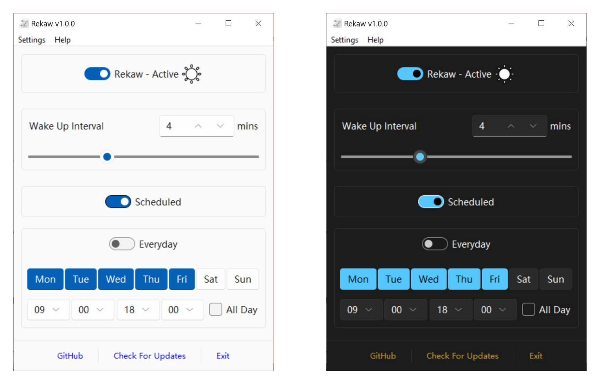

    <a href="./README.md">English</a> | 简体中文

> 
> "_嗨，不要着急，休息，休息一会儿！_" - Waker 

Waker是一个简单直接的macOS菜单栏应用，旨在保持你的Mac唤醒状态，防止某些应用（说的就是你，Teams）变成离开状态。

# 外观

## 菜单按钮状态

## 外观

# 主要功能

- 🎯 **保持唤醒**：防止你的PC及相关应用进入**离开**状态。
- 🙈 **防监控**：防止其他应用（你的管理员）监控Waker的状态。
- ⏰ **设置唤醒间隔**：设置唤醒间隔时间。
- ⏲ **计划运行时间**：设置Waker运行周期。
- 🚀 **开机自启**：设置Waker登录时自动启动。
- 🌒 **深色模式支持**：无缝切换浅色和深色模式。
- 🌟 **自动更新**：自动检查更新，及时获取最新功能。

# 安装

1. 请从 [发布页面](https://github.com/ChenglongMa/waker/releases/latest) 下载最新版本的Waker的 `.zip` 文件。
2. 将下载的文件解压到任意目录。
3. 运行 `Rekaw.exe`。

> [!NOTE]
> 
> * 该应用程序已更名为 **Rekaw**（Waker的反向拼写）以避免受到某些应用程序的监控。
> * 你可以在运行之前将 `.exe` 文件重命名为你喜欢的名称。
> * 你可以在设置中自定义应用程序的标题和图标。
> 

> [!WARNING]
> 
> 如果遇到Windows Defender SmartScreen警告，请单击“**更多信息**”，然后单击“**仍要运行**”以继续安装。
>
> 
> 
> 

# 工作原理

当你短暂离开电脑时，该应用通过模拟你的工作方式防止电脑进入“非活动”状态。

(在这里不太过多介绍具体原理，有兴趣可以给我发邮件 (**chenglong.m_at_outlook.com**)，我会详细解释)

# 用法

Waker 的使用方法非常直观，所见即所得。以下是一些小小的提示，以帮助你更好地使用该应用程序。

## 主要功能

### 手动运行

在应用中或任务栏菜单栏中切换 `主开关` 以手动运行或停止 Waker。

### 设置唤醒间隔

在应用中设置唤醒间隔，以防止某些应用程序变为非活动状态（比如**离开**）。Teams 自动转入离开状态的间隔为**5分钟**，所以建议设置小于等于**5分钟**的时间。

### 定时运行

设置 Waker 运行的时间周期，根据你的偏好和工作流程进行自定义使用。

比如，你可以设置该应用程序在**周一**到**周五**的**上午9:00**运行并在**下午6:00**关闭。**996** 打工仔请自觉绕道😂。

### 防监控

如图所示的 `设置` 菜单：
1. 你可以在设置中自定义应用程序的标题和图标，以防止其他应用程序（你的管理员）监控Waker的状态。
2. 你可以编辑语料库以模拟你的工作行为。

该功能后续将会进一步完善，欢迎各位提出建议。

### 自动更新

开启自动更新检查以获取最新版本的 Waker。

当然，你也可以手动单击菜单栏中的 `检查更新` 按钮检查更新。

# 开源贡献

👋 欢迎关注 **Waker**！很高兴有你的参与。以下是你可以参与的方式：

1. 💡 **讨论新想法**：有创意的想法或建议？在[Discussion](https://github.com/ChenglongMa/waker-mac/discussions)页面开始讨论，分享你的想法并从获得反馈。

2. ❓ **提问**：对仓库中的某些内容有疑问？随时开一个标记为“问题”的[issue](https://github.com/ChenglongMa/waker-mac/issues)或参与[Discussion](https://github.com/ChenglongMa/waker-mac/discussions)。

3. 🐛 **报告错误**：如果你发现了一个bug，请开一个新的[issue](https://github.com/ChenglongMa/waker-mac/issues)，并清楚描述问题、复现步骤以及你的运行环境。

4. ✨ **引入新功能**：想要为项目添加新功能或增强吗？Fork仓库，创建一个新分支，并提交一个带有你更改的[PR](https://github.com/ChenglongMa/waker-mac/pulls)。确保遵循我们的贡献指南。

5. 💖 **赞助**：如果您想更多地支持该项目，你可以通过[在GitHub上赞助仓库](https://github.com/sponsors/ChenglongMa)来实现。感谢各位金主大佬！

非常感谢各位对 **Waker** 的关注和支持！🙏
